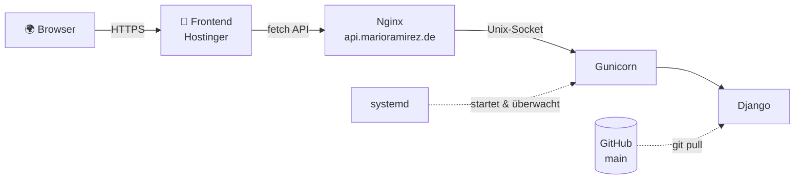

<div align="center">

```
╔════════════════════════════════════════════════════════╗
║                                                        ║
║   ░█▀▄░█▀▀░█▀█░█░░░█▀█░█░█░░░█▀▄░█▀█░█▀▀░█░█░█▀▀░░░   ║
║   ░█░█░█▀▀░█▀▀░█░░░█░█░░█░░░░█▀▄░█░█░█░█░█▀█░█▀▀░░░   ║
║   ░▀▀░░▀▀▀░▀░░░▀▀▀░▀▀▀░░▀░░░░▀▀░░▀▀▀░▀▀▀░▀░▀░▀▀▀░░░   ║
║                                                        ║
║      Server & Deployment Playbook  ·  Fullstack        ║
╚════════════════════════════════════════════════════════╝
```

# 🚀 Server & Deployment Playbook

**Von `git push` bis „läuft live" – Django-Backend + Frontend in 7 Schritten**


[🌐 Live-API](https://api.marioramirez.de/api/base-info/) · [🖥️ Projekte](https://www.marioramirez.de/projekte/) · [🚨 Notfall-Befehle](#-notfall-befehle)

</div>

---

## 🗺️ Architektur auf einen Blick



## 📌 Standard-Struktur & URLs

| | |
|:--|:--|
| 🎨 **Frontend** | `https://www.marioramirez.de/projekte/<frontend-ordner>/` (Hostinger / Webhosting) |
| ⚙️ **Backend-API** | `https://api.marioramirez.de/api/` (Ubuntu Cloud Server `213.160.75.13`) |
| 🔑 **SSH-Zugang** | `ssh marito1010@213.160.75.13` |
| 📂 **Projektpfad** | `/var/www/projekte/<projektname>_backend/` |

> [!TIP]
> Ersetze überall `<projektname>` durch den Namen deines Projekts und `<frontend-ordner>` durch den Ordner auf Hostinger.

---

## 🧭 Schritte

| # | Schritt | Wo |
|:-:|:--|:--|
| 1 | [Lokales Backend pushen](#1--lokales-backend-vorbereiten--pushen) | 💻 PC |
| 2 | [Repository klonen & einrichten](#2--auf-dem-server-repository-klonen--einrichten) | ☁️ Server |
| 3 | [`settings.py` anpassen](#3--django-settingspy-anpassen) | ☁️ Server |
| 4 | [Migrationen, Static Files & Accounts](#4--migrationen-static-files--gast-accounts) | ☁️ Server |
| 5 | [Gunicorn-Service einrichten](#5--gunicorn-systemd-service) | ☁️ Server |
| 6 | [Nginx konfigurieren](#6--nginx-konfigurieren) | ☁️ Server |
| 7 | [Frontend anbinden & hochladen](#7--frontend-anbinden--hochladen) | 🎨 Hostinger |

---

## 1 · Lokales Backend vorbereiten & pushen

Im lokalen Projektordner auf deinem PC:

```bash
git add .
git commit -m "Ready for production"
git push origin main
```

---

## 2 · Auf dem Server: Repository klonen & einrichten

Per SSH verbinden:

```bash
ssh marito1010@213.160.75.13
```

In das Verzeichnis wechseln und klonen:

```bash
cd /var/www/projekte
git clone <GITHUB_REPO_URL> <projektname>_backend
cd <projektname>_backend
```

Virtuelle Umgebung anlegen und Abhängigkeiten installieren:

```bash
python3 -m venv venv
source venv/bin/activate
pip install --upgrade pip
pip install -r requirements.txt
pip install gunicorn
```

---

## 3 · Django `settings.py` anpassen

```bash
nano core/settings.py
```

**✅ Checkliste**

**`ALLOWED_HOSTS`**

```python
ALLOWED_HOSTS = [
    'api.marioramirez.de',
    'marioramirez.de',
    'www.marioramirez.de',
    '213.160.75.13',
    'localhost',
    '127.0.0.1',
]
```

**`CORS_ALLOWED_ORIGINS`**

> [!WARNING]
> Nur die Origin eintragen – **ohne Pfad und ohne Slash am Ende!**

```python
CORS_ALLOWED_ORIGINS = [
    "https://marioramirez.de",
    "https://www.marioramirez.de",
]
# Alternativ für reine Testzwecke:
# CORS_ALLOW_ALL_ORIGINS = True
```

**Statische Pfade prüfen**

```python
STATIC_URL = '/static/'
STATIC_ROOT = BASE_DIR / 'static'
MEDIA_URL = '/media/'
MEDIA_ROOT = BASE_DIR / 'media'
```

💾 Speichern: `Strg + O` → `Enter` &nbsp;|&nbsp; ❌ Schließen: `Strg + X`

nano .env

SECRET_KEY=dein-geheimer-schlüssel-aus-deinem-lokalen-pc-hier-einfügen
DEBUG=False

---
💾 Speichern: `Strg + O` → `Enter` &nbsp;|&nbsp; ❌ Schließen: `Strg + X`
---

## 4 · Migrationen, Static Files & Gast-Accounts

```bash
python manage.py makemigrations
python manage.py migrate
python manage.py collectstatic --noinput
```

<details>
<summary><b>👤 Gast-Accounts ohne Passwort-Sperre erstellen</b></summary>

<br>

Über die Django-Shell werden die Passwort-Validierungen umgangen (z. B. „zu kurz" bei `asdasd`):

```bash
python manage.py shell -c "
from django.contrib.auth import get_user_model
User = get_user_model()

# 1. Kunde
u1, _ = User.objects.get_or_create(username='andrey')
u1.set_password('asdasd')
if hasattr(u1, 'type'): u1.type = 'customer'
u1.save()

# 2. Geschäftskonto
u2, _ = User.objects.get_or_create(username='kevin')
u2.set_password('asdasd24')
if hasattr(u2, 'type'): u2.type = 'business'
u2.save()

print('Accounts erfolgreich eingerichtet!')
"
```

</details>

---

## 5 · Gunicorn Systemd-Service

Service-Datei anlegen:

```bash
sudo nano /etc/systemd/system/<projektname>.service
```

Inhalt:

```ini
[Unit]
Description=Gunicorn daemon for <projektname>
After=network.target

[Service]
User=marito1010
Group=www-data
WorkingDirectory=/var/www/projekte/<projektname>_backend
ExecStart=/var/www/projekte/<projektname>_backend/venv/bin/gunicorn \
          --access-logfile - \
          --workers 3 \
          --bind unix:/var/www/projekte/<projektname>_backend/<projektname>.sock \
          core.wsgi:application

[Install]
WantedBy=multi-user.target
```

Dienst aktivieren und starten:

```bash
sudo systemctl daemon-reload
sudo systemctl start <projektname>
sudo systemctl enable <projektname>
sudo systemctl status <projektname>
```

---

## 6 · Nginx konfigurieren

```bash
sudo nano /etc/nginx/sites-available/<projektname>
```

Routing-Block:

```nginx
server {
    server_name api.marioramirez.de;

    location = /favicon.ico { access_log off; log_not_found off; }

    location /static/ {
        root /var/www/projekte/<projektname>_backend;
    }

    location /media/ {
        root /var/www/projekte/<projektname>_backend;
    }

    location / {
        include proxy_params;
        proxy_pass http://unix:/var/www/projekte/<projektname>_backend/<projektname>.sock;
    }
}
```

Aktivieren und prüfen:

```bash
sudo ln -s /etc/nginx/sites-available/<projektname> /etc/nginx/sites-enabled/
sudo nginx -t
sudo systemctl reload nginx
```

---

## 7 · Frontend anbinden & hochladen

**`config.js` im Frontend:**

```javascript
const API_BASE_URL = 'https://api.marioramirez.de/api/';
const STATIC_BASE_URL = 'https://api.marioramirez.de/';
```

**Dateien hochladen:** per FileZilla / FTP in das Hostinger-Verzeichnis

```
public_html/projekte/<frontend-ordner>/
```

**Im Browser öffnen:** `https://www.marioramirez.de/projekte/<frontend-ordner>/`

> [!NOTE]
> Cache leeren mit `Strg + F5`.

---

## 🚨 Notfall-Befehle

| 🔥 Problem | 💻 Befehl |
|:--|:--|
| Code in `settings.py` oder View geändert | `sudo systemctl restart <projektname>` |
| HTTP 400 Bad Request / Fehlersuche | `sudo journalctl -u <projektname> -n 30 --no-pager` |
| Neuen Stand von GitHub auf Server ziehen | `git pull origin main && sudo systemctl restart <projektname>` |
| Nginx-Syntax testen | `sudo nginx -t` |
| API im Terminal prüfen | `curl -i https://api.marioramirez.de/api/base-info/` |

---

<div align="center">

**Gebaut mit ☕ und Terminal von [Mario Ramirez](https://www.marioramirez.de)**

</div>
